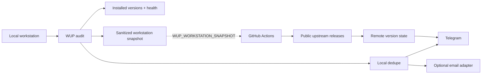

<p align="center">
  
</p>

<h1 align="center">WUP</h1>

<p align="center">
  
  
  
  
</p>

<p align="center"><strong>Know when your developer toolchain needs attention — locally, and optionally while your workstation is off.</strong></p>

WUP is a small, local-first developer toolchain watcher. It audits installed tools and runtime health, classifies meaningful version changes, deduplicates alerts, and can notify through Telegram or an optional email adapter. Its optional GitHub Actions sentinel watches public upstream releases without pretending it can inspect an offline workstation.

WUP is read-only by default: it does not install, upgrade, restart, or reconfigure the software it monitors.

## Why WUP

Developer machines accumulate CLIs, runtimes, package managers and local services that drift at different speeds. WUP keeps the boring part visible without becoming another always-on platform:

- local audit of installed versions and selected health signals;
- deterministic `CURRENT`, `WATCH`, `UPDATE`, `URGENT`, and `UNKNOWN` semantics;
- alert deduplication so unchanged findings stay quiet;
- Telegram notifications with optional external email delivery;
- remote upstream release awareness through GitHub Actions;
- an optional private workstation snapshot that can enrich remote alerts with the last locally observed version and age.

There is no WUP-hosted account system, VPS, daemon, database, or control plane required.

## What it monitors

The current Windows-first catalog includes probes for tools such as Codex CLI, OpenCodex, Codex Desktop, Node.js/npm, Bun, Python, Git, LM Studio and Wrangler, plus selected local integration/runtime checks. Detection rules and authoritative upstream sources are documented in [`references/managed-tools.md`](references/managed-tools.md).

The catalog is intentionally conservative: if WUP cannot obtain trustworthy evidence, it reports `UNKNOWN` rather than inventing a clean bill of health.

## How it works



The local watcher is authoritative for what is installed. The remote sentinel is authoritative only for what upstream has released. A stale workstation snapshot is shown as stale context; it is never presented as a fresh inspection.

## Quick start (Windows)

```powershell
git clone https://github.com/datawarsaw/wup.git
cd wup
Copy-Item wup.example.toml wup.toml
python -m unittest discover -s tests -p 'test_*.py'
python scripts/check_toolchain.py --offline
python scripts/run_notifier.py --dry-run --config wup.toml
```

Python 3.10+ is required. Node.js is needed only for Node-based checks or an external email adapter.

`--dry-run` renders notifications without sending them or advancing deduplication state. Use it before enabling any scheduler or external notification channel.

## Diagnostics (Doctor)

Run the strictly read-only diagnostics to verify repository integrity, configuration validity, runtime prerequisites, and state readability without making any changes:

```powershell
python scripts/doctor.py
python scripts/doctor.py --json
```

`doctor.py` is strictly non-mutating: it never creates, edits, or deletes configuration, state files, or scheduled tasks.

## Configuration

Copy [`wup.example.toml`](wup.example.toml) to `wup.toml`. Configuration covers:

- monitored tool selection;
- local state-directory override;
- optional local Workstation Ops/MCP repository path for its audit check;
- Telegram enablement;
- optional external email command;
- remote repository/state-branch identity used by the snapshot bridge.

The TOML file is non-secret. Do not put tokens or credentials in it.

### Telegram

Telegram is a valid standalone notification path. Enable it in configuration and provide:

- `TELEGRAM_BOT_TOKEN`
- `TELEGRAM_CHAT_ID`

through the process environment. For same-user scheduled tasks, configuration
may instead point `env_file` at a local untracked file containing only those
two keys; process environment values win. WUP owns a small bounded Telegram
transport and does not commit these values.

### Email

Email is optional. WUP can call an external command that accepts:

```text
send --subject TEXT --text TEXT --html TEXT
```

This keeps provider-specific email credentials and policy outside WUP. A Telegram-only installation is fully supported.

## Remote monitoring

[`WUP Remote Version Sentinel`](.github/workflows/toolchain-remote-version-sentinel.yml) can observe public upstream releases through GitHub Actions while the workstation is off.

It keeps public upstream runtime state on the isolated `toolchain-remote-state`
branch:

- `remote-version-state.json` — upstream release dedupe only.

An optional sanitized workstation snapshot uses the same documented schema but
is stored privately as GitHub Actions secret `WUP_WORKSTATION_SNAPSHOT`. Local
publishing uses the existing authenticated `gh` CLI with the JSON supplied on
standard input; WUP creates no PAT. A snapshot by itself never triggers a
release alert and never participates in upstream release deduplication.

A first observation is silent. Repeated identical observations are silent. A workstation snapshot by itself never triggers a release alert.

The workflow ships manual-only in the initial public repository. Scheduling and repository secrets are opt-in deployment steps rather than hidden defaults.

## Finding semantics

| Status | Meaning |
| --- | --- |
| `CURRENT` | Installed version matches the verified target and relevant checks pass. |
| `WATCH` | Worth attention, but WUP deliberately stops short of recommending an update. |
| `UPDATE` | A newer stable release is verified and a manual update is recommended. |
| `URGENT` | A critical update or broken monitored component needs prompt attention. |
| `UNKNOWN` | WUP could not obtain trustworthy evidence. Never treated as `CURRENT`. |

Health is tracked separately from version status so a current version can still surface a runtime problem.

## Windows scheduler

WUP includes a same-user, non-elevated Task Scheduler manager. The default task runs daily at 08:00 local time, can start at the next availability after a missed run, may wake the PC, ignores overlapping runs, and has a bounded execution time.

```powershell
powershell -NoProfile -ExecutionPolicy Bypass -File scripts/manage-scheduled-task.ps1 -Action Install
powershell -NoProfile -ExecutionPolicy Bypass -File scripts/manage-scheduled-task.ps1 -Action Status
powershell -NoProfile -ExecutionPolicy Bypass -File scripts/manage-scheduled-task.ps1 -Action Remove
```

Create an untracked `wup.toml` before installation. The manager records its
explicit path in the task action, so scheduled execution never depends on a
working directory. Task arguments contain executable/configuration paths only
— never credentials.

## Privacy and security

WUP stores local deduplication state outside Git (by default under `%LOCALAPPDATA%\WUP`). Configuration examples contain no secrets. Public remote state contains upstream release facts only; optional workstation snapshot context is held only as an Actions secret.

External network access is limited to the public release/version sources and notification integrations you choose to configure. WUP does not require a hosted WUP service.

See [`SECURITY.md`](SECURITY.md) for vulnerability reporting guidance.

## Project status

WUP is an early public project extracted from a tool that already runs in production for its original author. The standalone repository is intentionally conservative: Windows first, read-only by default, and focused on making the existing behavior portable before adding larger features.

Planned ideas include easier installation/diagnostics, a safe update `PLAN -> APPLY` assistant, and a lightweight local status/history view. These are roadmap ideas, not promises or hidden runtime behavior.

## Contributing

Small, focused contributions are welcome. Please read [`CONTRIBUTING.md`](CONTRIBUTING.md) before opening a pull request.

## License

WUP is available under the [MIT License](LICENSE).
